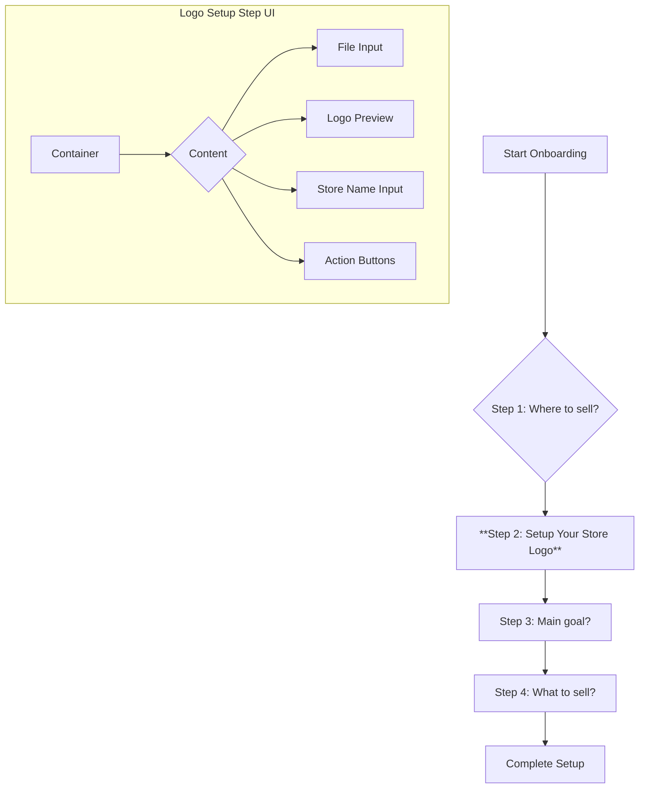

# Onboarding: Logo Setup Step Design

This document outlines the design for a new mandatory "Logo Setup" step in the user onboarding process.

## 1. UI/UX Design

The new step will be inserted into the existing onboarding flow, likely as the new **Step 2**, shifting the subsequent steps accordingly.

### Wireframe & Description

**UI Components:**

*   **File Input:** A styled file input that accepts common image formats (e.g., PNG, JPG, SVG). It will feature a clear call-to-action, such as "Upload a logo" or "Choose a file."
*   **Logo Preview:** A circular or square preview area that displays either the uploaded logo or the generated placeholder. This provides immediate visual feedback to the user.
*   **Store Name Input:** A standard text input for the user's store name. This may be pre-filled if the user has already provided this information in a previous step.
*   **Action Buttons:** "Continue" and "Skip for now" buttons. The "Skip for now" button will trigger the placeholder generation logic.

## 2. Data Model

The user's Firestore document in the `users` collection will be updated to include a new field for the store logo.

*   **`storeLogoUrl` (string):** This field will store the URL of the uploaded logo in Firebase Storage. If the user skips the upload, this field will store the URL of the generated placeholder SVG.

## 3. Placeholder Logic

If the user proceeds without uploading a logo, a placeholder will be generated and used as the default.

*   **Generation Logic:** The placeholder will be an SVG image with a solid background color and the first letter of the `storeName`.
*   **Implementation:** The placeholder SVG will be generated on the frontend and then uploaded to Firebase Storage. This approach ensures that the `storeLogoUrl` always points to a valid image URL, simplifying the data model and frontend logic.

## 4. Onboarding Flow

The `withOnboarding` HOC and the onboarding page will be modified to enforce the new step.

*   **`app/onboarding/page.tsx`:**
    *   A new `Step2` component will be created for the logo setup UI.
    *   The `handleNext` and `handleFinish` functions will be updated to handle the new step and the `storeLogoUrl` data.
*   **`components/withOnboarding.tsx`:**
    *   The `checkOnboardingStatus` function will be updated to check for the presence of the `storeLogoUrl` field in the user's document.
    *   If `storeLogoUrl` is missing, the user will be redirected to the onboarding page to complete the logo setup step.

This ensures that the user cannot access the dashboard until they have either uploaded a logo or a placeholder has been set.